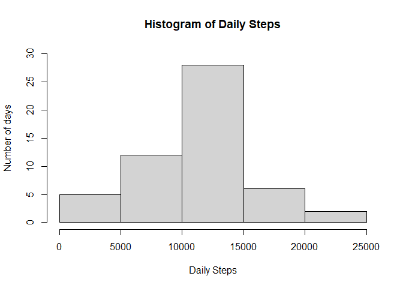

## Loading and preprocessing the data
To load the data, it has been loaded to a variable called activity.  

```r
activity <- read.csv('activity.csv')
```
Then, processing the date was only made by converting the dates to date class deleting all NA's from the dataset.

```r
activity$date <- as.Date(activity$date, "%Y-%m-%d")
activity$interval <- activity$interval %/% 100 * 60 + (activity$interval - (activity$interval %/% 100) * 100)
## The abone line of code converts intervals to daytime in  minutes.
activity2 <- na.omit(activity)
head(activity2) ## To view the head of the data
```

```
##     steps       date interval
## 289     0 2012-10-02        0
## 290     0 2012-10-02        5
## 291     0 2012-10-02       10
## 292     0 2012-10-02       15
## 293     0 2012-10-02       20
## 294     0 2012-10-02       25
```
## What is mean total number of steps taken per day?  
The total number of steps for each day was calculated by summing all steps in all intervals within each day.  

```r
library(dplyr)
```

```
## 
## Attaching package: 'dplyr'
```

```
## The following objects are masked from 'package:stats':
## 
##     filter, lag
```

```
## The following objects are masked from 'package:base':
## 
##     intersect, setdiff, setequal, union
```

```r
steps_daily <- activity2%>%group_by(date)%>%summarize(steps = sum(steps))
```

```
## `summarise()` ungrouping output (override with `.groups` argument)
```

```r
## The above line of code will group the data by date and then sum the steps.
mean_steps <- round(mean(steps_daily$steps)) 
median_steps <- round(median(steps_daily$steps))
## The rounding was used as number of steps can't be a fraction
```
The median daily steps is 1.0765\times 10^{4} while the average is 1.0766\times 10^{4}  
The following figure shows the histogram of the total number of steps taken each day

```r
hist(steps_daily$steps, ylim = c(0, 30), 
     xlab = "Daily Steps", ylab = "Number of days",
     main = "Histogram of Daily Steps")
```

<!-- -->

## What is the average daily activity pattern?  
TO find the pattern in each day, the steps were averaged over the days for each interval.

```r
activity_im <- activity %>% group_by(interval) %>% summarize(steps = round(mean(steps, na.rm = TRUE)))
```

```
## `summarise()` ungrouping output (override with `.groups` argument)
```

```r
with(activity_im, plot(interval, steps, type = "l", xlab = "Day time in minutes"))
```

<!-- -->

```r
## interval with highest steps mean
max_steps <- max(activity_im$steps)
interval <- activity_im[activity_im$steps == max_steps, 'interval']
interval_h <- interval %/% 60
interval_m <- as.character(interval - 60 * interval_h)
interval_h <- as.character(interval_h)
interval_t <- paste(interval_h, ':', interval_m)
```

The interval with the maximum steps is 515 min from mid night which correspond to 8 : 35.   

## Imputing missing values

The missing values can be filled with different methods, the approach used here is to fill NAs with the average value of the interval among all days.

```r
activity_filled <- activity
for (i in 1:nrow(activity)){
    if (is.na(activity_filled[i,'steps'])){
        activity_filled[i,'steps'] <- round(activity_im[activity_im$interval == activity_filled[i,'interval'], 'steps'])
    }
}
steps_daily2 <- activity_filled%>%group_by(date)%>%summarize(steps = sum(steps))
```

```
## `summarise()` ungrouping output (override with `.groups` argument)
```

```r
mean_steps2 <- round(mean(steps_daily2$steps)) 
median_steps2 <- round(median(steps_daily2$steps))
```
The daily mean of steps is now 1.0766\times 10^{4} and the median is 1.0762\times 10^{4}  
To view the change in the histogram:

```r
hist(steps_daily2$steps, ylim = c(0, 40), 
     xlab = "Daily Steps", ylab = "Number of days",
     main = "Histogram of Daily Steps")
```

<!-- -->

## Are there differences in activity patterns between weekdays and weekends?
First a column has been added to the dataset to show either it's a weekday or weekend day.

```r
activity$week <- ''
for (i in 1 : nrow(activity)){
    if (weekdays(activity[i,'date']) %in% c("Saturday", "Sunday")){
        activity[i,'week'] <- "weekend"
    }else{activity[i,'week'] <- "weekday"}
}

activity_im2 <- activity %>% group_by(interval, week) %>% summarize(steps = round(mean(steps, na.rm = TRUE)))
```

```
## `summarise()` regrouping output by 'interval' (override with `.groups` argument)
```

```r
library(lattice)
xyplot(steps~interval|week, data = activity_im2, xlab = "Day time in min",
       ylab = "steps", main = "Change in steps between weekday and weekend",
       type='b')
```

<!-- -->
